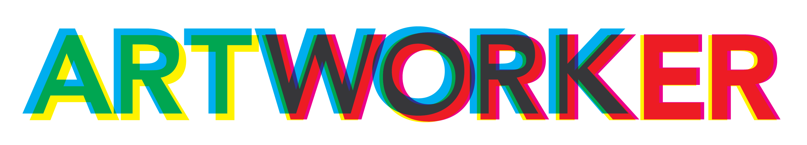
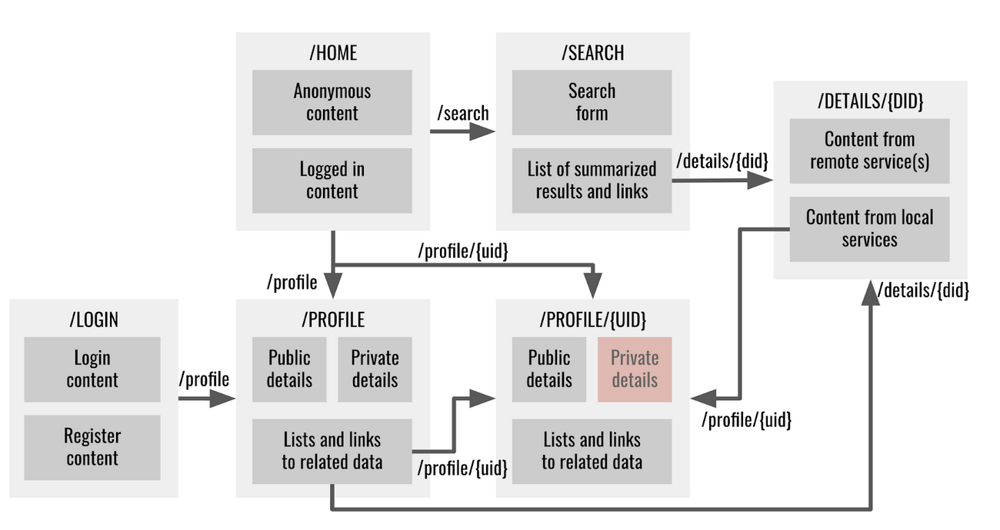

# ArtWorker

Artworker is a React-based social networking platform designed for curators and artists who are passionate about art and who are looking for a convenient way to share their collections and network with other professionals in the industry.

With Artworker, users can easily create accounts and connect with other users to discover and curate a wide range of artworks, from classical paintings to modern sculptures. The platform allows users to create their own virtual galleries and share them with other users, providing a unique and personalized experience for each curator and artist.

Artworker is also designed to help artists promote their artwork to a wider audience, with features such as tagging and sharing options. Curators can follow their favorite artists to discover new and emerging talents and keep up-to-date with their latest works.

In addition to sharing and curating art, Artworker is also designed to help users expand their professional networks. Users can connect with other curators and artists from around the world, share their expertise, and collaborate on projects.

Overall, Artworker is a vibrant community of art lovers, curators, and artists who share a passion for the world of art. Whether you're an established curator, a budding artist, or just a lover of beautiful works of art, Artworker is the perfect platform for you to share, explore, and connect with others who share your interests.

## Getting Started

In the project directory, you can run:

### `npm start`

Runs the app in the development mode.\
Open [http://localhost:3000](http://localhost:3000) to view it in your browser.

The page will reload when you make changes.\
You may also see any lint errors in the console.

## Navigation

| Route                         | Description                                                                |
| -----------------------------| -------------------------------------------------------------------------- |
| `/artworks/:id`              | Display details of a specific artwork identified by its `id` parameter     |
| `/art/search`                | Display a search form for artworks                                          |
| `/art/search/:searchTerm`    | Display search results for artworks matching the `searchTerm` parameter    |
| `/art`                       | Display a gallery of all artworks                                           |
| `/create`                    | Display a form for creating a new artwork                                    |
| `/admin`                     | Display an administrative dashboard for managing artworks and users        |
| `/profile`                   | Display the authenticated user's profile                                    |
| `/profile/:userId`           | Display the profile of the user identified by the `userId` parameter        |
| `/login`                     | Display a login form for the user to authenticate                            |
| `/register`                  | Display a registration form for a new user to sign up                        |
| `/`                          | Display the home page of the application                                     |